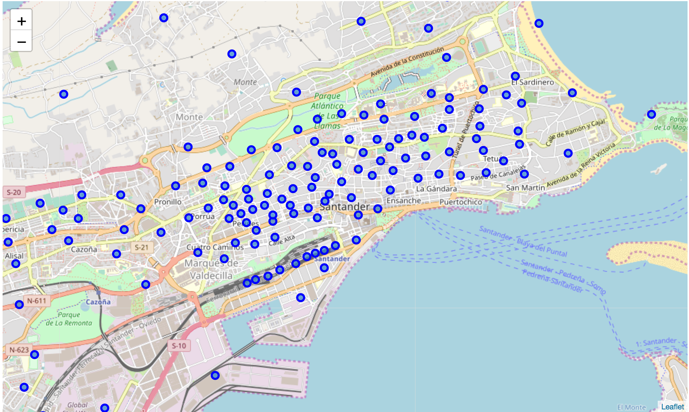
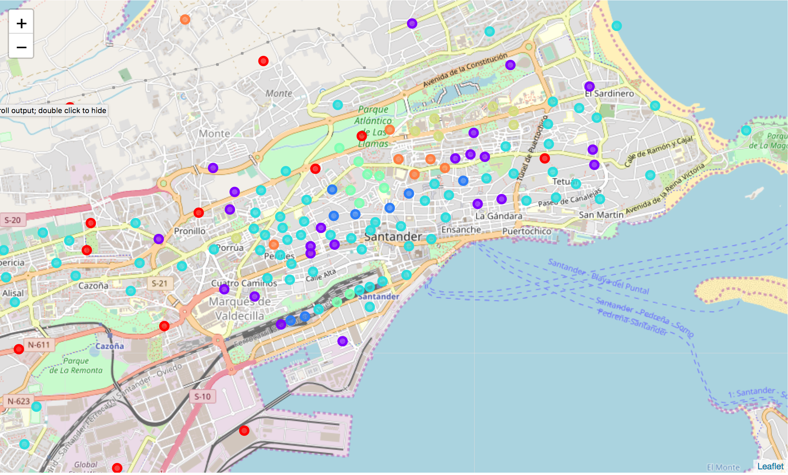
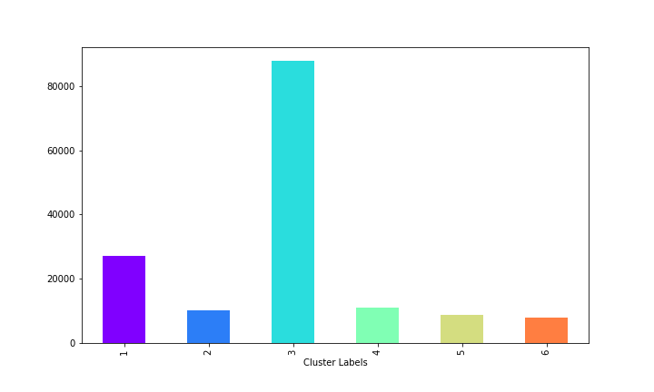

# Machine learning for city development policy implementation

## Introduction

In cities across the world there are neighborhoods that concentrate most of the activity and other neighborhoods that concentrate most of the housing space. These heterogeneities force people to move from their living places to the working and leisure centers, inducing road traffic that generates pollution and wastes people's time, especially in cities where public transport systems are not well adapted.

In this project I want to explore the differences between areas of a city, analyzing the kind of activities that create the most important leisure centers and exploring the changes, new businesses or activities, required to be created in some regions to make them more similar to the areas that concentrate the activity. The final aim would be for decision-makers to have a tool to design policies to reduce the differences between areas of a city, increasing the homogeneity and making a more livable city for the people.

I am going to focus the analysis on Santander, a small city in the North of Spain that I know pretty well. Knowledge of field conditions is important for the development of this project, as some subjective information on the quality and development of the different areas of the city is required. The methodology, however, can be applied to any other city.

## Data and Methods

The data used for this project will be obtained from Foursquare ([https://es.foursquare.com/](https://foursquare.com/)) and from Santander Datos Abiertos ([http://datos.santander.es/)](http://datos.santander.es/)). Information on businesses will be obtained from Foursquare, while Santander Datos Abiertos will provide information about administrative boundaries, zip codes, parking spaces per area and population.

The first step of the methodology consists on dividing the city into smaller areas to be able to analyze the heterogeneities of the distribution of people and activities. Information on city sections ([http://datos.santander.es/dataset/?id=distritos-secciones](http://datos.santander.es/dataset/?id=distritos-secciones)) is obtained from Santander Datos Abiertos. The information about the sections contains also information about the total population in the section. The information is complemented with other datasets about surface parking slots ([http://datos.santander.es/dataset/?id=sensores-parking-superficie](http://datos.santander.es/dataset/?id=sensores-parking-superficie)), underground parking spots ([http://datos.santander.es/dataset/?id=aparcamientos-subterraneos](http://datos.santander.es/dataset/?id=aparcamientos-subterraneos)), gardens ([http://datos.santander.es/dataset/?id=jardines](http://datos.santander.es/dataset/?id=jardines)), public parks ([http://datos.santander.es/dataset/?id=parques](http://datos.santander.es/dataset/?id=parques)), markets ([http://datos.santander.es/dataset/?id=mercados-mercadillos](http://datos.santander.es/dataset/?id=mercados-mercadillos)), bike stations ([http://datos.santander.es/dataset/?id=estaciones-bicicletas](http://datos.santander.es/dataset/?id=estaciones-bicicletas)), taxi stops ([http://datos.santander.es/dataset/?id=paradas-taxis](http://datos.santander.es/dataset/?id=paradas-taxis)), bus stops([http://datos.santander.es/dataset/?id=paradas-bus](http://datos.santander.es/dataset/?id=paradas-bus)), museums ([http://datos.santander.es/dataset/?id=museos](http://datos.santander.es/dataset/?id=museos)) and other elements that may impact the characteristics of a section.

All the data is combined into a dataframe that contains all the explicative variables for every section of the city. The information is then vectorized to include a count of the number of services offered in every section, that is, the total number of parking slots, total number of gardens, total number of parks is computed. This information is complemented with the information obtained from Foursquare, thus including information about the number of cafeterias, restaurants, clothing shops and other businesses in every section. The so formed dataset will be the working dataset for the project.

A clustering algorithm will then be used to classify the different section into groups of similar sections. The total number of clusters will be selected in such a way that the clustering is compatible with the field experience, that is, ensuring that each cluster really represent a quantity and quality of activity that can be observed on the field. If discrepancies are observed between the clustering algorithm output and the classification based on experience, different machine learning techniques will be tested to map the section characteristics to the group assigned by experience and field work.

The objective of the previous task is to construct the decision boundaries that separate the different classes. Once these boundaries have been constructed, it will be easy to compute the minimal set of changes that should be implemented into one section of the city to transform it into a different type, that is, how to modify one section to change the overall level of activity and make it more similar to the objective that we may be pursuing as decision-makers.

The information collected breaks the city of Santander into several sections that are shown in the figure below.

## Results

The Foursquare API has been used to collect the information about the different venues present in the different sections of the city of Santander. Every section is assigned a vector that summarizes its characteristics which contains the 10 most important venues of the area. Different section of the city have been clustered based on the most important venues, obtaining the classification shown in the following figure.

The most present cluster group is cluster number 3 (in cyan in the image above). This kind of section can be found all over the city, without any privileged area. This extensive area coverage also concentrates most of the population of the city as is shown in the figure below.

This cluster is characterized by the presence of convenience stores, supermarkets and small bars. It contains most of the housing spaces in the city.

Another important cluster type is number 1 (in purple in the figures) which characterizes most of the commercial areas, with a wide range of restaurants and other services such as pharmacies. This cluster type is the second in importance regarding population.

Cluster 2, in navy, contains most of the bar and pub areas of the city. These areas tend to have some problems related to noise, due to nocturnal activity, and for that reason it contains a small portion of the population.

Clusters 4, 5 and 6 contain most of the services of the city: gift shops, comics shops, clothing shops, etc. They are the least populated clusters mainly due to the fact that are in areas where only office buildings are present and thus, no housing is present.

The analysis of results shows that there is not a clear pattern that explains the distribution of services and population in the city. It may be due to the small size of the city, but services do not seem to properly cluster in space. Only the bars and pubs seem to be properly clusterized in a specific spatial regions for the rest of the services are interspersed.

It seem that the historic evolution of the city is stronger for explaining the distribution of services and venues that a real socio-economic dynamics. Indeed, Santander was destroyed by a big fire in 1941 that forced the city to reinvent itself. Many streets were changed and new neighborhoods were created. Commercial activity was concentrated in the city center, and the old uses were displaced to new areas.

## Conclusions

Small cities like Santander seem to be a example for the application of regressions techniques to the explanation of their dynamics. The small number of population and commercial activity means that most of the sections appear as outliers, due to the fact that very little areas are alike, there is always something that makes a section very different to other one.

In any case, the classification carried out clearly shows that most of the housing sections are surrounded by commercial areas that offer most of the services required; therefore making it difficult to show possible ways to improve the city.

The methodology however may be applied to larger cities, where the larger amount of population and the larger space to cover, can generate opportunities to improve the presence of important commercial activities for the section or the neighborhood.
